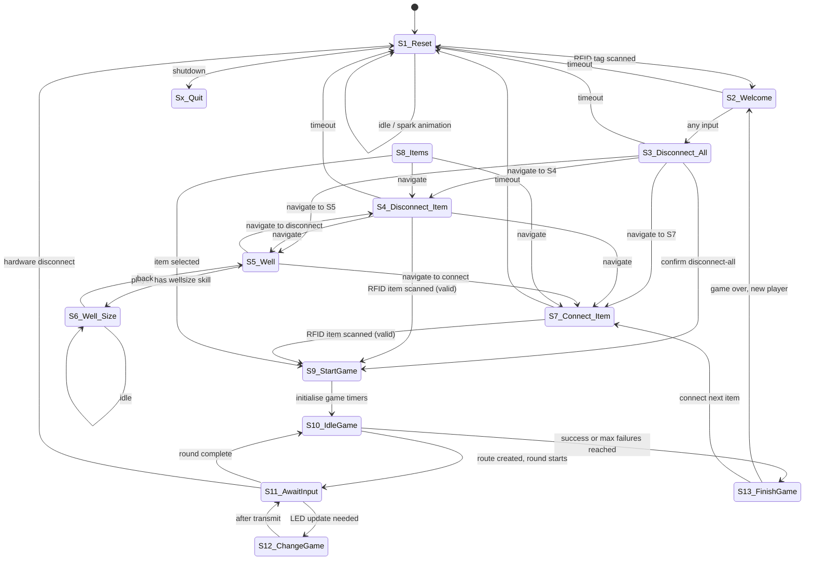

# MARVIN MainController — Architecture

<!-- MAINTENANCE: Update this document after every phase that changes architecture,
     module structure, hardware connections, or startup sequence. Check the diff
     against the phase plan doc and mark the completed phase in that file. -->

## Overview

MARVIN (Magical Arcane Repository Via Interactive Node) is a Python application running on a Raspberry Pi 4. It controls a physical octagonal gaming table equipped with ~400 NeoPixel LEDs across 64 segments, 8 game buttons, a RFID scanner, and a display screen. The system implements a 13-state state machine that manages player interactions, item connections, and LED-driven mini-games.

Desktop simulation is supported: without hardware attached the keyboard replaces buttons/RFID and pygame renders the screen.

**Last updated:** Phase 3 complete (Phases 1, 1b, 2, 3 done; Phases 4–6 not yet implemented).

---

## Module Dependency Graph

```
MARVIN.py  (entry point)
│
├── states_enum.py         # State/transition definitions (no side effects)
├── glbs.py                # Global initialisation & shared state
│   ├── _Display.py        # Pygame screen rendering (hardware + simulation)
│   ├── _InputHandler.py   # Button, RFID, keyboard, and mouse input
│   │   └── _Table.py      # (button name lookup)
│   ├── _Items.py          # Item inventory & power node
│   ├── _Devices.py        # Serial communication to Arduino(s) + reconnect
│   ├── _Table.py          # LED segment graph, spark/energy-flow effects
│   ├── _Players.py        # Player registry & skill lookup
│   ├── _LineGame.py       # BaseGame ABC + LineGame (snake) implementation
│   ├── _RuneGame.py       # RuneGame (rune/symbol recognition) implementation
│   └── _GameContext.py    # Round-state dataclass (glbs.ctx)
│
├── S1_Reset.py            # (all state modules import glbs)
├── S2_Welcome.py
├── S3_Disconnect_All.py
├── S4_Disconnect_Item.py
├── S5_Well.py
├── S6_Well_Size.py
├── S7_Connect_Item.py
├── S8_Items.py
├── S9_StartGame.py
├── S10_IdleGame.py
├── S11_AwaitInput.py
├── S12_ChangeGame.py
└── S13_FinishGame.py
```

---

## State Machine



### State Descriptions

| # | Name | Purpose |
|---|------|---------|
| S1 | Reset | Idle state. **Active** status: soft glowing EnergyFlow animation. **Broken**: random spark flashes. Wakes on RFID scan. `down` key enters GM tag-assign sub-loop. |
| S2 | Welcome | Shows the active player's name. Any input advances to S3. |
| S3 | Disconnect All | Menu to disconnect all connected items. Requires `disconnectall` skill. |
| S4 | Disconnect Item | Disconnect a single item via RFID scan. Requires `disconnect1item` skill. |
| S5 | Well | Navigation hub: show well capacity (→S6) or connect/disconnect items. |
| S6 | Well Size | Displays current power draw vs. capacity as a circle on screen. |
| S7 | Connect Item | Connect an item via RFID scan. Validates player skill against item level. |
| S8 | Items | Scrollable item menu for manual selection (GM override path). |
| S9 | StartGame | Sets `glbs.ctx.gameStartTime` and `glbs.ctx.gameTimeout`; transitions immediately to S10. |
| S10 | IdleGame | Picks a random goal button, builds the LED snake route, checks win/fail conditions. |
| S11 | AwaitInput | Animates the snake (one LED per loop) and reads button input. |
| S12 | ChangeGame | Transmits the updated LED array to the Arduino and returns to S11. |
| S13 | FinishGame | Displays result, updates item state, calls `glbs.ctx.reset()` to clear all round variables. |

---

## Hardware Connections

### RFID_LED Arduino (VID:PID `2A03:0042`, 500000 baud)

Handles both RFID reading and NeoPixel LED driving.

**Receive (Arduino → Pi):**

| Byte 0 | Meaning | Remaining bytes |
|--------|---------|-----------------|
| `B` | Button press | Byte 1: screen-button bitmask (8 bits); Byte 2: game-button bitmask (8 bits) |
| `T` | RFID tag | Bytes 1–4: 32-bit tag ID (big-endian) |
| `quit` | Shutdown requested | — |

**Transmit (Pi → Arduino):**

```
[startByte=\r] [R G B] [R G B] ... [stopByte=\n] [CRC]
```

CRC = XOR of all R, G, B bytes. One RGB triple per LED, transmitted in segment order (segm0 → segm63).

### GSM Arduino (VID:PID `1234:5678`, 9600 baud)

Placeholder device. Not yet used in active game logic.

---

## Startup Sequence

1. `MARVIN.py` is invoked.
2. `import glbs` executes module-level code in order:
   - `pygame.init()`
   - `glbs.parser` reads `marvinconfig.txt` (state config, device IDs, screen size).
   - `_InputHandler()` — input abstraction layer.
   - `_Items(item_file)` — reads `itemconfig.txt` with its own parser; starts hot-reload watcher.
   - `_Devices(config_file)` — reads `marvinconfig.txt` with its own parser; starts reconnect watcher. **Must be before `_Display`** (sim-mode detection).
   - `_Table(table_file)` — reads `tableconfig.txt` with its own parser. **Must be before `_Display`** (LED positions).
   - `_Players(player_file)` — reads `playerconfig.txt` with its own parser; starts hot-reload watcher.
   - `_Display(config_file)` — last; detects sim vs hardware by checking `_Devices.get_device("RFID_LED")`.
   - `LineGame(table)` — bound to the table graph; assigned to `glbs.snake_game`.
   - `RuneGame(table, config_file, rune_config_file)` — loads runeconfig.txt; assigned to `glbs.rune_game`.
   - `glbs.game` defaults to `glbs.snake_game`; S9 switches it to `glbs.rune_game` based on `[GameModes]` config.
   - `GameContext()` — round-state dataclass; assigned to `glbs.ctx`.
3. `main()` instantiates all 13 state objects.
4. Main loop starts at `S1_Reset`.

**Each subsystem reads its own config file with a private `configparser` instance.** `glbs.parser` contains only marvinconfig.txt and is used by state modules to read their `[StateN]` sections.

---

## Configuration Files

| File | Purpose |
|------|---------|
| `marvinconfig.txt` | Device IDs, screen size, per-state timeouts and skill requirements |
| `tableconfig.txt` | LED segment graph, button definitions, route constraints, colours |
| `itemconfig.txt` | Item registry: RFID IDs, levels, power load, connection state |
| `playerconfig.txt` | Player registry: RFID IDs, skill lists |

See [config_reference.md](config_reference.md) for full key documentation.

---

## Desktop Simulation Mode

When no Arduino is detected at startup (`_Devices.get_device("RFID_LED")` returns `None`), the system runs in simulation mode automatically — no flag or config change needed.

**Window:** 950×700 pygame window with two panels:

| Panel | Content |
|-------|---------|
| Left (0–700 px) | Live LED ring renderer: all 64 segments drawn at their physical positions. Menu screen image overlaid centred in the ring when active. |
| Right (700–950 px) | RFID scan panel: clickable player and item buttons inject RFID events. Active player, last input, current round inputs, and route length shown at the bottom. |

**Keyboard input:**

| Key | Action |
|-----|--------|
| Arrow keys | up / down / left / right |
| H | east button |
| Y | northeast button |
| T | north button |
| R | northwest button |
| F | west button |
| V | southwest button |
| B | south button |
| N | southeast button |
| ESC | quit |

**Mouse input:**

| Click target | Action |
|-------------|--------|
| Outer button label (ring edge) | Injects the corresponding game button keydown event |
| Player name in RFID panel | Injects an RFID scan event for that player |
| Item name in RFID panel | Injects an RFID scan event for that item |

The last-pressed outer button is highlighted with a filled circle until the next click.

---

## Game Mode Architecture

Game modes are implemented as `BaseGame` subclasses in `_LineGame.py` and `_RuneGame.py`:

- **`BaseGame`** (abstract, in `_LineGame.py`) — defines the interface `start(goal)`, `update()`, `is_complete()`, `clear()`.
- **`LineGame`** (concrete) — builds snake routes through the segment graph. `mode = 'snake'`.
- **`RuneGame`** (concrete, `_RuneGame.py`) — reveals geometric rune symbols via BFS animation; player identifies the owning button. `mode = 'runes'`.
- **`glbs.game`** — the active `BaseGame` instance. S9 switches it based on `[GameModes] levelN` in `marvinconfig.txt`. S10/S11/S12/S13 use only the `BaseGame` interface.
- **`[GameModes]` config** (in `marvinconfig.txt`):
  ```ini
  [GameModes]
  level1 = snake
  level2 = runes
  level3 = runes
  ```
- **S1 rune catalog browser:** pressing `right` in S1 idle (simulation only) enters a rune catalog sub-loop showing all 48 rune definitions with their LED shapes rendered on the ring.

<!-- Phase 5 will add MultiSnakeGame (mode = 'multisnake') here. -->

**Rune config:** `runeconfig.txt` holds 48 rune definitions — 6 per button × 8 buttons. Each section has `name`, `button`, and `leds` (comma-separated `segmentname:led_index` pairs). Currently placeholder content — LED definitions to be filled in before hardware testing.

---

## Round State (`glbs.ctx`)

All mutable per-round variables live in a `GameContext` dataclass at `glbs.ctx`:

| Attribute | Type | Description |
|-----------|------|-------------|
| `gameStartTime` | float | `time.time()` when the round started |
| `gameTimeout` | float | Allowed duration in seconds |
| `currentInput` | str | Last raw input (currently unused) |
| `currentGameRoute` | list | `_Segment` objects for the active snake; set by `LineGame.start()` |
| `currentRoundInputs` | list | Button inputs recorded this round |
| `gameSuccess` | bool | True if the round was completed successfully |
| `gameFailures` | int | Failure count (starts at −1 to compensate S10 first-call logic) |
| `snakeCounter` | int | LED-step counter for the S11 animation loop |
| `returnState` | any | State to return to after S9/S13 |
| `prevStateName` | any | Previous menu state name (used by skip logic in S3/S4/S5/S7) |

`glbs.ctx.reset()` clears all of the above to their initial values. Called by S13 after each round.

---

## RFID Tag Management

Player and item RFID tags can be updated without restarting MARVIN:

**Hot-reload (automatic):** `_Players` and `_Items` each run a background daemon thread that polls their config file every 3 seconds. If the file modification time changes (e.g. after an SSH edit or USB copy), `reload()` is called immediately. Item `connected` state and the active player reference are preserved across reloads.

**GM scan-to-assign (in-app):** In S1_Reset, pressing `down` enters a tag assignment sub-loop:

```
down         →  enter GM mode (display shows player + item list)
left / right →  move highlight through the list
present tag  →  writes new ID to config file; reload fires immediately
left / right →  move to next entry
up           →  exit, return to S1 idle
```

Entries updated in the current session show `✓ <name> [<new_id>]`. On hardware the full screen is used; in simulation the right panel shows the assign list.

**Scope:** Tag reassignment only. Adding new player names, changing skills, or adding items requires editing the config file externally (SSH or USB).
