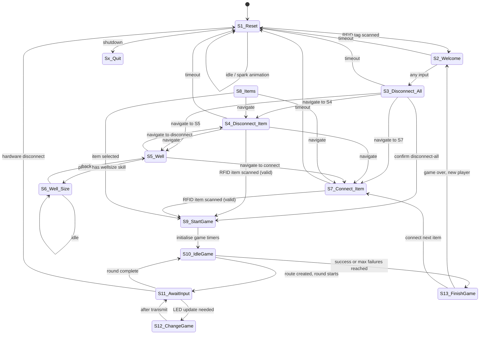

# MARVIN MainController — Architecture

<!-- MAINTENANCE: Update this document after every phase that changes architecture,
     module structure, hardware connections, or startup sequence. Check the diff
     against the phase plan doc and mark the completed phase in that file. -->

## Overview

MARVIN (Magical Arcane Repository Via Interactive Node) is a Python application running on a Raspberry Pi 4. It controls a physical octagonal gaming table equipped with ~400 NeoPixel LEDs across 64 segments, 8 game buttons, a RFID scanner, and a display screen. The system implements a 13-state state machine that manages player interactions, item connections, and LED-driven mini-games.

Desktop simulation is supported: without hardware attached the keyboard replaces buttons/RFID and pygame renders the screen.

**Last updated:** Phases 1–5 complete. Phase 4b (`_Players` → `_Characters` rename) applied. Phase 5 multiline mode is the default for L1/L2/L3 items (`[GameModes]` in `marvinconfig.txt`). Phase 6 hardware fixes ongoing — see `docs/plans/`.

---

## Module Dependency Graph

```
MARVIN.py  (entry point)
│
├── states_enum.py         # State/transition definitions (no side effects)
├── glbs.py                # Global initialisation & shared state
│   ├── _Display.py        # Pygame screen rendering (hardware + simulation)
│   ├── _InputHandler.py   # Button, RFID, keyboard, and mouse input
│   │   └── _Table.py      # (button name lookup)
│   ├── _Items.py          # Item inventory & power node (hot-reload watcher)
│   ├── _Devices.py        # Serial communication to Arduino(s) + reconnect
│   ├── _Table.py          # LED segment graph, lightning-spark engine,
│   │                      #   EnergyFlow body, AmbientFlow drift engine,
│   │                      #   well-size visualisation, orange-flash feedback
│   ├── _Characters.py     # Character registry & skill lookup (hot-reload watcher);
│   │                      #   shared _normalize_id / _scrub_id helpers
│   ├── _MQTT.py           # MQTT client: publish game events, accept EDD commands
│   ├── _LineGame.py       # BaseGame ABC + LineGame + MultiLineGame implementations
│   ├── _RuneGame.py       # RuneGame (rune/symbol recognition) implementation
│   └── _GameContext.py    # Round-state dataclass (glbs.ctx)
│
├── S1_Reset.py            # (all state modules import glbs)
├── S2_Welcome.py
├── S3_Disconnect_All.py
├── S4_Disconnect_Item.py
├── S5_Well.py
├── S6_Well_Size.py
├── S7_Connect_Item.py
├── S8_Items.py
├── S9_StartGame.py
├── S10_IdleGame.py
├── S11_AwaitInput.py
├── S12_ChangeGame.py
└── S13_FinishGame.py
```

---

## State Machine



### State Descriptions

| # | Name | Purpose |
|---|------|---------|
| S1 | Reset | Idle state. **Active** status: soft glowing AmbientFlow drift (`idle` mode). **Broken**: lightning-spark bursts at random intervals. **Disabled**: LEDs off, RFID input ignored (EDD-commanded). Wakes on RFID scan (publishes `state/rfid` via MQTT). Fires heartbeat every 30 s. `down` key enters GM tag-assign sub-loop; inside that sub-loop **north** cycles `[MultiLineGame] mode` (default / nofaults / uniform) and **south** toggles `[Rules] decoupleMode` (lenient / strict), both persisted to `marvinconfig.txt`. `right` key (simulation only) enters the rune catalog browser. |
| S2 | Welcome | Shows the active character's name. Any input advances to S3. `AmbientFlow` continues drifting in `menu` mode behind the screen image. |
| S3 | Disconnect All | Menu to disconnect all connected items. Requires `disconnectall` skill. |
| S4 | Disconnect Item | Disconnect a single item via RFID scan. Requires `disconnect1item` skill. Decouple-mode `strict` additionally requires `disconnect{item.level}`. |
| S5 | Well | Navigation hub: show well capacity (→S6) or connect/disconnect items. |
| S6 | Well Size | Displays current power draw vs. capacity as a circle on screen **and** on the LED table via `_Table.draw_well_size()`. Two modes: `radial` (area-metaphor lit annulus growing inward) and `pathflow` (light flowing from buttons toward centre); **left** key toggles at runtime. Animation loop pulses a palette through the lit zone (`[WellSize]` config). On exit calls `fade_to_black(2.0)` so the visualisation doesn't bleed into S5. See `docs/well_size_led_design.md`. |
| S7 | Connect Item | Connect an item via RFID scan. Validates `connect{level}` against the character's skill list. Insufficient skill → `_Table.feedback_orange_flash()`. GM (`isGM`) bypasses the skill check; an overload then triggers a randomised lightning-spark burst (`[common] overloadSparkMin/Max`). |
| S8 | Items | Scrollable item menu for manual selection (GM override path). |
| S9 | StartGame | Sets `glbs.ctx.gameStartTime` and `glbs.ctx.gameTimeout`; selects the active game by item level via `[GameModes] level{N}` (`line` / `multiline` / `runes`) and assigns the matching instance to `glbs.game`. Calls `glbs.table.fade_to_black(1.0)` before handing off to S10. |
| S10 | IdleGame | Decides the round structure for the current game mode: line picks a random goal button and builds a single LED route; multiline calls `MultiLineGame.start()` to build N real lines (+1 false line in `default`/`uniform` mode); rune mode delegates sequence selection to `RuneGame.start()` (smart-timeout shortcut may finish the game early). Tracks failures against `[State10] failuresPerLevel`. |
| S11 | AwaitInput | Animates the line (line: head/tail step; multiline: all routes in parallel) or ticks `RuneGame.update()`; collects button inputs into `glbs.ctx.currentRoundInputs`. |
| S12 | ChangeGame | Transmits the updated LED array to the Arduino and returns to S11. |
| S13 | FinishGame | Displays result, updates item state, calls `glbs.ctx.reset()` to clear all round variables. |

---

## Hardware Connections

### RFID_LED Arduino (VID:PID `2A03:0042`, 500000 baud)

Handles both RFID reading and NeoPixel LED driving.

**Receive (Arduino → Pi):**

| Byte 0 | Meaning | Remaining bytes |
|--------|---------|-----------------|
| `B` | Button press | Byte 1: screen-button bitmask (8 bits); Byte 2: game-button bitmask (8 bits) |
| `T` | RFID tag | Bytes 1–4: 32-bit tag ID (big-endian) |
| `quit` | Shutdown requested | — |

**Transmit (Pi → Arduino):**

```
[startByte=\r] [R G B] [R G B] ... [stopByte=\n] [CRC]
```

CRC = XOR of all R, G, B bytes. One RGB triple per LED, transmitted in segment order (segm0 → segm63).

### GSM Arduino (VID:PID `1234:5678`, 9600 baud)

Placeholder device. Not yet used in active game logic.

---

## Startup Sequence

1. `MARVIN.py` is invoked.
2. `import glbs` executes module-level code in order:
   - `pygame.init()`
   - `glbs.parser` reads `marvinconfig.txt` (state config, device IDs, screen size, MQTT, game-mode dispatch, rules toggles).
   - `_InputHandler()` — input abstraction layer.
   - `_Items(item_file)` — reads `itemconfig.txt` with its own parser; starts hot-reload watcher.
   - `_Devices(config_file)` — reads `marvinconfig.txt` with its own parser; starts reconnect watcher. **Must be before `_Display`** (sim-mode detection).
   - `_Table(table_file)` — reads `tableconfig.txt` with its own parser. **Must be before `_Display`** (LED positions).
   - `_Characters(character_file)` — reads `characterconfig.txt` with its own parser; starts hot-reload watcher. Assigned to `glbs.characters`.
   - `_Display(config_file)` — last subsystem; detects sim vs hardware by checking `_Devices.get_device("RFID_LED")`.
   - `LineGame(table)` → `glbs.line_game`.
   - `MultiLineGame(table, parser)` → `glbs.multiline_game`.
   - `RuneGame(table, config_file, rune_config_file)` → `glbs.rune_game` (loads `runeconfig.txt`).
   - `glbs.game` defaults to `glbs.line_game`; S9 swaps it for `glbs.multiline_game` or `glbs.rune_game` based on `[GameModes] level{N}`.
   - `_MQTT(config_file)` — reads `[MQTT]` from `marvinconfig.txt`; connects to broker (non-blocking). Assigned to `glbs.mqtt`.
   - `AmbientFlow(table, parser)` — shared idle/menu drift engine ticked from S1 (`idle`) and S2–S7 (`menu`). Assigned to `glbs.ambient_flow`.
   - `GameContext()` — round-state dataclass; assigned to `glbs.ctx`.
3. `main()` instantiates all 13 state objects.
4. Main loop starts at `S1_Reset`.

**Each subsystem reads its own config file with a private `configparser` instance.** `glbs.parser` contains only marvinconfig.txt and is used by state modules to read their `[StateN]` sections and by S1's GM-rules toggles to read/write `[MultiLineGame] mode` and `[Rules] decoupleMode`.

---

## Configuration Files

| File | Purpose |
|------|---------|
| `marvinconfig.txt` | Device IDs, screen size, per-state timeouts and skill requirements, MQTT, `[GameModes]` mode-per-level dispatch, `[LineGame] / [MultiLineGame] / [RuneGame]` game parameters, `[Rules] decoupleMode`, `[MenuEffect]` / `[WellSize]` animation parameters |
| `tableconfig.txt` | LED segment graph, button definitions, route constraints, colour palette |
| `itemconfig.txt` | Item registry: RFID IDs, levels, power load, connection state, well capacity (`source`) |
| `characterconfig.txt` | Character registry: name, RFID IDs, skill lists, `gm` flag |
| `runeconfig.txt` | Rune definitions (48 sections — 6 per button × 8 buttons): `name`, `button`, `leds` |

See [config_reference.md](config_reference.md) for full key documentation.

---

## Desktop Simulation Mode

When no Arduino is detected at startup (`_Devices.get_device("RFID_LED")` returns `None`), the system runs in simulation mode automatically — no flag or config change needed.

**Window:** 950×700 pygame window with two panels:

| Panel | Content |
|-------|---------|
| Left (0–700 px) | Live LED ring renderer: all 64 segments drawn at their physical positions. Menu screen image overlaid centred in the ring when active. |
| Right (700–950 px) | RFID scan panel: clickable character and item buttons inject RFID events. Active character, last input, current round inputs, and route length shown at the bottom. |

**Keyboard input:**

| Key | Action |
|-----|--------|
| Arrow keys | up / down / left / right |
| H | east button |
| Y | northeast button |
| T | north button |
| R | northwest button |
| F | west button |
| V | southwest button |
| B | south button |
| N | southeast button |
| ESC | quit |

**Mouse input:**

| Click target | Action |
|-------------|--------|
| Outer button label (ring edge) | Injects the corresponding game button keydown event |
| Character name in RFID panel | Injects an RFID scan event for that character |
| Item name in RFID panel | Injects an RFID scan event for that item |

The last-pressed outer button is highlighted with a filled circle until the next click.

---

## Game Mode Architecture

Game modes are implemented as `BaseGame` subclasses in `_LineGame.py` and `_RuneGame.py`:

- **`BaseGame`** (abstract, in `_LineGame.py`) — defines the interface `start(goal)`, `update()`, `is_complete()`, `clear()`.
- **`LineGame`** (concrete) — builds a single line route through the segment graph from a random inner-ring segment to a goal button. `mode = 'line'`.
- **`MultiLineGame`** (concrete, subclass of `LineGame`) — runs several routes in parallel. Each route is independently animated; routes may share segments. Per-route direction tuples and per-LED ref-counts on `_Segment` handle merge/cross correctly. `mode = 'multiline'`. Reads `[MultiLineGame]` for per-level real-line counts and an optional false line (distinct colour) that immediately ends the round if pressed.
- **`RuneGame`** (concrete, `_RuneGame.py`) — reveals geometric rune symbols via BFS animation; player identifies the owning button by pressing it. Sequence length scales with item level (L1=1, L2=3, L3=5). `mode = 'runes'`.
- **`glbs.game`** — the active `BaseGame` instance. S9 switches it based on `[GameModes] levelN` in `marvinconfig.txt`. S10/S11/S12/S13 branch on `glbs.game.mode` for the round-shape differences (e.g. multi-line failure scoring vs. single-line) but otherwise use the `BaseGame` interface.
- **`[GameModes]` config** (in `marvinconfig.txt`, current default):
  ```ini
  [GameModes]
  level1 = multiline
  level2 = multiline
  level3 = multiline
  ```
  Acceptable values per level: `line`, `multiline`, `runes`.

- **GM rules toggles (S1 sub-loop, screen buttons only):**
  - `north` → cycle `[MultiLineGame] mode` through `default` → `nofaults` → `uniform`.
    - `default` — per-level real-line count + one false line.
    - `nofaults` — per-level real-line count, no false line.
    - `uniform` — exactly 1 real + 1 false line at every level.
  - `south` → toggle `[Rules] decoupleMode` between `lenient` (only the menu-access skill is checked, effectively 1 skill needed to disconnect any item) and `strict` (additionally requires `disconnect{item.level}`, so the full kit spans 3 skills).
  - Both changes are persisted to `marvinconfig.txt` immediately. A status line at the top of the GM assign screen shows the current values (e.g. `linegame: default    disconnect: 1 skill`).

- **S1 rune catalog browser:** pressing `right` in S1 idle (simulation only) enters a rune catalog sub-loop showing all 48 rune definitions with their LED shapes rendered on the ring; `left` / `right` scroll, `up` exits.

**Rune config:** `runeconfig.txt` holds 48 rune definitions — 6 shape templates × 8 buttons. Each section has `name`, `button`, and `leds` (comma-separated `segmentname:led_index` pairs). Shapes use complete segments (~22–40 LEDs each) so they read clearly at LED resolution; the six templates are Outer Pair, Right Spoke, Left Spoke, Outer Triple, Outer Horseshoe, Inner Horseshoe (see runeconfig.txt header comment).

---

## MQTT Subsystem (`glbs.mqtt`)

`_MQTT.py` connects MARVIN to an MQTT broker (default `localhost:1883`) for two-way communication with EDD/GMControl. Requires `paho-mqtt>=2.0`.

**Publish (state events):** RFID scans, item connect/disconnect/overload/cleared, game failure/success, table status, heartbeat, config version. State files call convenience methods like `glbs.mqtt.publish_rfid_character(...)` / `publish_rfid_item(...)` / `publish_rfid_unknown(...)` at the relevant moment — no MQTT logic lives inside state files.

**Subscribe (commands):** Register new characters/items, set table status (including `Disabled`), change well capacity, update LED colours, config sync with EDD. All command handlers live in `_MQTT.py`.

**Graceful degradation:** If `[MQTT] enabled = false` or `paho-mqtt` is not installed, the module initialises as a no-op — all publish calls silently return. The game runs identically without a broker.

**Config sync:** On connect, MARVIN publishes its `config_version` (monotonically incrementing integer in `itemconfig.txt [items]`). EDD responds with a `cmd/sync/offer`. If EDD's version is higher, MARVIN accepts EDD data and overwrites local config. If MARVIN's version is higher, it publishes `state/sync/push` so EDD can update.

See [phase4_mqtt.md](plans/260411_phase4_mqtt.md) for full topic/payload specification. See [edd_marvin_integration.md](edd_marvin_integration.md) for the EDD-side implementation guide covering how to add MARVIN support to the C#/.NET EDD codebase.

---

## Round State (`glbs.ctx`)

All mutable per-round variables live in a `GameContext` dataclass at `glbs.ctx`:

| Attribute | Type | Description |
|-----------|------|-------------|
| `gameStartTime` | float | `time.time()` when the round started |
| `gameTimeout` | float | Allowed duration in seconds |
| `currentInput` | str | Reserved single-slot mirror of the most recent raw input event. Currently unwritten — intended hand-off slot between the input handler and any future non-line game mode that wants the last token without scanning `currentRoundInputs`. |
| `currentGameRoute` | list | `(segment, direction)` tuples for the active line; set by `LineGame.start()`. For `multiline`, also set to the first real route's tuples for S11 backward compatibility. |
| `currentRoundInputs` | list | Button inputs recorded this round |
| `gameSuccess` | bool | True if the round was completed successfully |
| `gameFailures` | int | Failure count (starts at −1 to compensate S10 first-call logic; rune mode resets to 0 in S9) |
| `lineCounter` | int | LED-step counter for the S11 animation loop |
| `returnState` | any | State to return to after S9/S13 |
| `prevStateName` | any | Previous menu state name (used by skip logic in S3/S4/S5/S7) |

`glbs.ctx.reset()` clears all of the above to their initial values. Called by S13 after each round.

---

## RFID Tag Management

Character and item RFID tags can be updated without restarting MARVIN. All tag IDs are 10-character uppercase hex strings (e.g. `0000CCA97F`), normalised on read so the same value can be entered as `cca97f`, `0xCCA97F`, etc.

**Hot-reload (automatic):** `_Characters` and `_Items` each run a background daemon thread that polls their config file every 3 seconds. If the file modification time changes (e.g. after an SSH edit or USB copy), `reload()` is called immediately. Item `connected` state and the active character reference (matched by name) are preserved across reloads.

**Cross-file uniqueness:** When a tag is written via `write_tag()` (from GM assign or MQTT register), the helper scrubs that tag from any other section in the same file *and* the sibling file (items↔characters) so a single physical tag is owned by at most one entity. Sentinel `0000000000` is written to the scrubbed sections.

**GM scan-to-assign (in-app):** In S1_Reset, pressing `down` enters a tag assignment sub-loop:

```
down         →  enter GM mode (display shows character + item list)
left / right →  move highlight through the list
north        →  cycle [MultiLineGame] mode (default / nofaults / uniform), persisted
south        →  toggle [Rules] decoupleMode (lenient / strict), persisted
present tag  →  writes new ID to config file; cross-file scrub + reload fires immediately
up           →  exit, return to S1 idle
```

Entries updated in the current session show `✓ <name> [<new_id>]`. On hardware the full screen is used; in simulation the right panel shows the assign list. The status line at the top of the screen reflects the current rules-toggle values.

**MQTT registration:** EDD can register new characters and items via `cmd/rfid/register` — the RFID ID, name, skills (character) or level/load/function (item) are written to the config file and `reload()` is called automatically.

**Scope:** GM scan-to-assign handles tag reassignment only. Adding new character names, changing skills, or adding items requires either MQTT registration from EDD or editing the config file externally (SSH or USB).

**Special IDs:**
- `0000000000` — `CharacterUnknown` sentinel; excluded from the lookup dict. A scrubbed tag holds this value.
- `000000000A` — GM override card (decimal `10`). Character record with `gm = true` whose ID is this sentinel is used to detect the dedicated GM card; any character marked `gm = true` in the config is also treated as GM at runtime.
