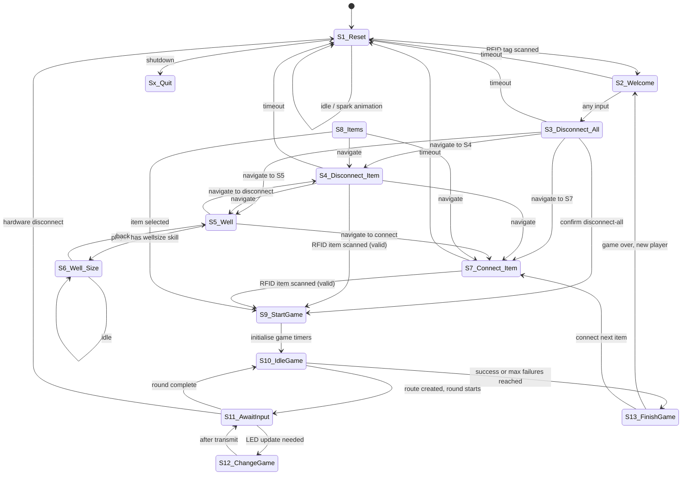

# MARVIN MainController — Architecture

## Overview

MARVIN (Magical Arcane Repository Via Interactive Node) is a Python application running on a Raspberry Pi 4. It controls a physical octagonal gaming table equipped with ~494 NeoPixel LEDs, 8 game buttons, a RFID scanner, and a 480×320 display. The system implements a 13-state state machine that manages player interactions, item connections, and LED-driven mini-games.

Desktop simulation is supported: without hardware attached the keyboard replaces buttons/RFID and pygame renders the screen.

---

## Module Dependency Graph

```
MARVIN.py  (entry point)
│
├── states_enum.py         # State/transition definitions (no side effects)
├── glbs.py                # Global initialisation & shared state
│   ├── _Display.py        # Pygame screen rendering
│   ├── _InputHandler.py   # Button, RFID, and keyboard input
│   │   └── _Table.py      # (button name lookup)
│   ├── _Items.py          # Item inventory & power node
│   ├── _Devices.py        # Serial communication to Arduino(s)
│   ├── _Table.py          # LED segment graph, snake routing, spark effects
│   └── _Players.py        # Player registry & skill lookup
│
├── S1_Reset.py            # (all state modules import glbs)
├── S2_Welcome.py
├── S3_Disconnect_All.py
├── S4_Disconnect_Item.py
├── S5_Well.py
├── S6_Well_Size.py
├── S7_Connect_Item.py
├── S8_Items.py
├── S9_StartGame.py
├── S10_IdleGame.py
├── S11_AwaitInput.py
├── S12_ChangeGame.py
└── S13_FinishGame.py
```

---

## State Machine



### State Descriptions

| # | Name | Purpose |
|---|------|---------|
| S1 | Reset | Idle state. Plays spark animations. Wakes on RFID scan. Handles table status (Off / Active / Broken / Overload). |
| S2 | Welcome | Shows the active player's name. Any input advances to S3. |
| S3 | Disconnect All | Menu to disconnect all connected items. Requires `disconnectall` skill. |
| S4 | Disconnect Item | Disconnect a single item via RFID scan. Requires `disconnect1item` skill. |
| S5 | Well | Navigation hub: show well capacity (→S6) or connect/disconnect items. |
| S6 | Well Size | Displays current power draw vs. capacity as a circle on screen. |
| S7 | Connect Item | Connect an item via RFID scan. Validates player skill against item level. |
| S8 | Items | Scrollable item menu for manual selection (GM override path). |
| S9 | StartGame | Sets `gameStartTime` and `gameTimeout`; transitions immediately to S10. |
| S10 | IdleGame | Picks a random goal button, builds the LED snake route, checks win/fail conditions. |
| S11 | AwaitInput | Animates the snake (one LED per loop) and reads button input. |
| S12 | ChangeGame | Transmits the updated LED array to the Arduino and returns to S11. |
| S13 | FinishGame | Displays result, updates item state, resets game globals. |

---

## Hardware Connections

### RFID_LED Arduino (VID:PID `2A03:0042`, 500000 baud)

Handles both RFID reading and NeoPixel LED driving.

**Receive (Arduino → Pi):**

| Byte 0 | Meaning | Remaining bytes |
|--------|---------|-----------------|
| `B` | Button press | Byte 1: screen-button bitmask (8 bits); Byte 2: game-button bitmask (8 bits) |
| `T` | RFID tag | Bytes 1–4: 32-bit tag ID (big-endian) |
| `quit` | Shutdown requested | — |

**Transmit (Pi → Arduino):**

```
[startByte=\r] [R G B] [R G B] ... [stopByte=\n] [CRC]
```

CRC = XOR of all R, G, B bytes. One RGB triple per LED, transmitted in segment order (segm0 → segm63).

### GSM Arduino (VID:PID `1234:5678`, 9600 baud)

Placeholder device. Not yet used in active game logic.

---

## Startup Sequence

1. `MARVIN.py` is invoked.
2. `import glbs` executes module-level code:
   - `pygame.init()`
   - Config files parsed: `marvinconfig.txt`, `itemconfig.txt`, `tableconfig.txt`, `playerconfig.txt`
   - All subsystem objects created: `_Display`, `_InputHandler`, `_Items`, `_Devices`, `_Table`, `_Players`
3. `main()` instantiates all 13 state objects.
4. Main loop starts at `S1_Reset`.

---

## Configuration Files

| File | Purpose |
|------|---------|
| `marvinconfig.txt` | Device IDs, screen size, per-state timeouts and skill requirements |
| `tableconfig.txt` | LED segment graph, button definitions, route constraints, colours |
| `itemconfig.txt` | Item registry: RFID IDs, levels, power load, connection state |
| `playerconfig.txt` | Player registry: RFID IDs, skill lists |

See [config_reference.md](config_reference.md) for full key documentation.

---

## Desktop Simulation Mode

When no Arduino is detected (`_Devices` finds no matching USB device), `_InputHandler` falls back to keyboard input:

| Key | Action |
|-----|--------|
| Arrow keys | up / down / left / right |
| H | east button |
| Y | northeast button |
| T | north button |
| R | northwest button |
| F | west button |
| V | southwest button |
| B | south button |
| N | southeast button |
| ESC | quit |

The pygame window (480×320, `NOFRAME`) shows menu JPEGs from the `menu/` folder and power-usage circles. Full LED ring visualisation is planned for Phase 2.
